<a id="readme-top"></a>

# GramediKu — Library Management System

[](https://laravel.com)
[](https://www.php.net/)
[](https://mariadb.org/)
[](https://getbootstrap.com)
[](#license)

A web-based library management system built with Laravel 11. Manages book collections, member data, borrowing & return transactions, and a reservation system with admin approval workflow.

<p align="right">(<a href="#readme-top">back to top</a>)</p>

---

## Table of Contents

- [About The Project](#about-the-project)
    - [Built With](#built-with)
    - [Use Case](#use-case)
- [Features](#features)
- [Database Schema](#database-schema)
- [Getting Started](#getting-started)
    - [Prerequisites](#prerequisites)
    - [Installation](#installation)
- [Usage](#usage)
    - [Default Accounts](#default-accounts)
    - [How to Use](#how-to-use)
    - [Routes Overview](#routes-overview)
- [Project Structure](#project-structure)
- [Application Architecture](#application-architecture)
- [Roadmap](#roadmap)
- [Milestone Status](#milestone-status)
- [Screenshots](#screenshots)
- [Contributing](#contributing)
- [Authors](#authors)
- [License](#license)

<p align="right">(<a href="#readme-top">back to top</a>)</p>

---

## About The Project

GramediKu is a digital library management system developed as a final project for the Web Programming 3 (Laravel) course. The application provides a centralized platform for managing library operations including book cataloging, member registration, borrowing & return transactions, and a reservation system where members can request books and admins approve or reject them.

### Why This Project?

- Digitalizes manual library management processes into a single web platform
- Implements role-based access control (Admin & Member) with separate dashboards
- Provides real-time stock tracking and automatic late fine calculation
- Features a reservation workflow with pending → approved/rejected status flow

### Built With

- [Laravel 11](https://laravel.com) — PHP web framework
- [PHP 8.4](https://www.php.net/) — Server-side language
- [MariaDB 11.8](https://mariadb.org/) — Relational database
- [Bootstrap 5.3](https://getbootstrap.com) — CSS framework
- [Bootstrap Icons 1.11](https://icons.getbootstrap.com) — Icon library
- [Chart.js 4.4](https://www.chartjs.org/) — Dashboard charts (bar & doughnut)
- [Vite 6](https://vitejs.dev/) — Frontend build tool
- [DDEV](https://ddev.com) — Local development environment

### Use Case

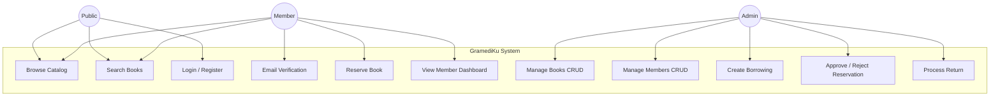

### Use Case Details

| Use Case | Actor | Description | Route |
|----------|-------|-------------|-------|
| **Browse Catalog** | Public, Member | View all books with cover, title, author, and availability status | `/catalog` |
| **Search Books** | Public, Member | Search books by title, author, or category; filter by availability | `/catalog?search=&category=&availability=` |
| **Login / Register** | Public | Authenticate with email/password or create new member account | `/login`, `/register` |
| **Email Verification** | Member | Verify email address via link sent to inbox before accessing member features | `/verify-email` |
| **Reserve Book** | Member | Request to borrow a book; status set to "pending" until admin approval | `/catalog/{book}/reserve` |
| **View Member Dashboard** | Member | View personal stats (pending, borrowed, returned, total fine) and active borrowings | `/member/dashboard` |
| **Manage Books CRUD** | Admin | Create, read, update, delete books with cover image upload and stock management | `/books/*` |
| **Manage Members CRUD** | Admin | Create, read, update, delete library members with borrowing history view | `/members/*` |
| **Create Borrowing** | Admin | Record new borrowing with auto-generated borrow number (PJ/YYYYMMDD/XXXX) | `/borrowings/create` |
| **Approve / Reject Reservation** | Admin | Review pending reservations, approve (stock -1) or reject (no stock change) | `/borrowings/{id}/approve`, `/borrowings/{id}/reject` |
| **Process Return** | Admin | Record book return with automatic late fine calculation (Rp 1,000/day) | `/borrowings/{id}/return` |
| **Print Receipt** | Admin | Generate printable borrowing receipt for member | `/borrowings/{id}/print` |

<p align="right">(<a href="#readme-top">back to top</a>)</p>

---

## Features

### Public (No Login Required)

| Feature          | Description                                                                          |
| ---------------- | ------------------------------------------------------------------------------------ |
| **Book Catalog** | Browse books with search (title/author/category) and filters (category/availability) |
| **Book Detail**  | View detailed book information including stock and location                          |

### Authentication

| Feature                | Description                                                                                        |
| ---------------------- | -------------------------------------------------------------------------------------------------- |
| **Login**              | Email/password authentication with role-based redirect (admin → dashboard, member → member portal) |
| **Register**           | New member registration with auto-generated username and member number                             |
| **Email Verification** | Members must verify email before accessing member portal (admin auto-verified)                     |
| **Logout**             | Session invalidation and token regeneration                                                        |

### Admin Dashboard

| Feature                 | Description                                                                    |
| ----------------------- | ------------------------------------------------------------------------------ |
| **Statistics Cards**    | Total books, available books, total members, active borrowings, returned, late |
| **Monthly Chart**       | Bar chart showing borrowing trends over the last 6 months                      |
| **Category Chart**      | Doughnut chart showing book distribution by category                           |
| **Late Borrowings**     | Table of overdue borrowings with due dates                                     |
| **Recent Transactions** | Latest 5 borrowing transactions                                                |

### Admin — Book Management (CRUD)

| Feature    | Description                                                                                    |
| ---------- | ---------------------------------------------------------------------------------------------- |
| **Create** | Add new book with title, author, publisher, ISBN, category, year, stock, location, cover image |
| **Read**   | List books with search and availability filter, paginated (10/page)                            |
| **Update** | Edit book data, auto-adjust available stock when total stock changes                           |
| **Delete** | Remove book with cover image cleanup from storage                                              |

### Admin — Member Management (CRUD)

| Feature    | Description                                                              |
| ---------- | ------------------------------------------------------------------------ |
| **Create** | Register new member with auto-generated member number                    |
| **Read**   | List members with search (name/email/member number), paginated (10/page) |
| **Update** | Edit member data                                                         |
| **Delete** | Remove member (blocked if active borrowing exists)                       |

### Admin — Borrowing Management

| Feature                 | Description                                                               |
| ----------------------- | ------------------------------------------------------------------------- |
| **Create Borrowing**    | Record new borrowing with auto-generated borrow number (PJ/YYYYMMDD/XXXX) |
| **Approve Reservation** | Approve pending reservation, set borrow date, decrease stock              |
| **Reject Reservation**  | Reject pending reservation, no stock change                               |
| **Print Receipt**       | Printable borrowing receipt                                               |
| **Delete**              | Remove borrowing record, restore stock if active                          |

### Admin — Book Return

| Feature            | Description                                                       |
| ------------------ | ----------------------------------------------------------------- |
| **Process Return** | Record return with automatic late fine calculation (Rp 1,000/day) |
| **Stock Update**   | Automatically increase available stock on return                  |

### Member Portal

| Feature                | Description                                                                      |
| ---------------------- | -------------------------------------------------------------------------------- |
| **Dashboard**          | Personal stats (pending, borrowed, returned, total fine), active borrowings list |
| **Borrowing History**  | Full borrowing history with status filter, paginated (10/page)                   |
| **Profile**            | View and edit phone & address                                                    |
| **Reserve Book**       | Reserve available book from catalog (status: pending)                            |
| **Cancel Reservation** | Cancel own pending reservation                                                   |

### Reservation System (Workflow)

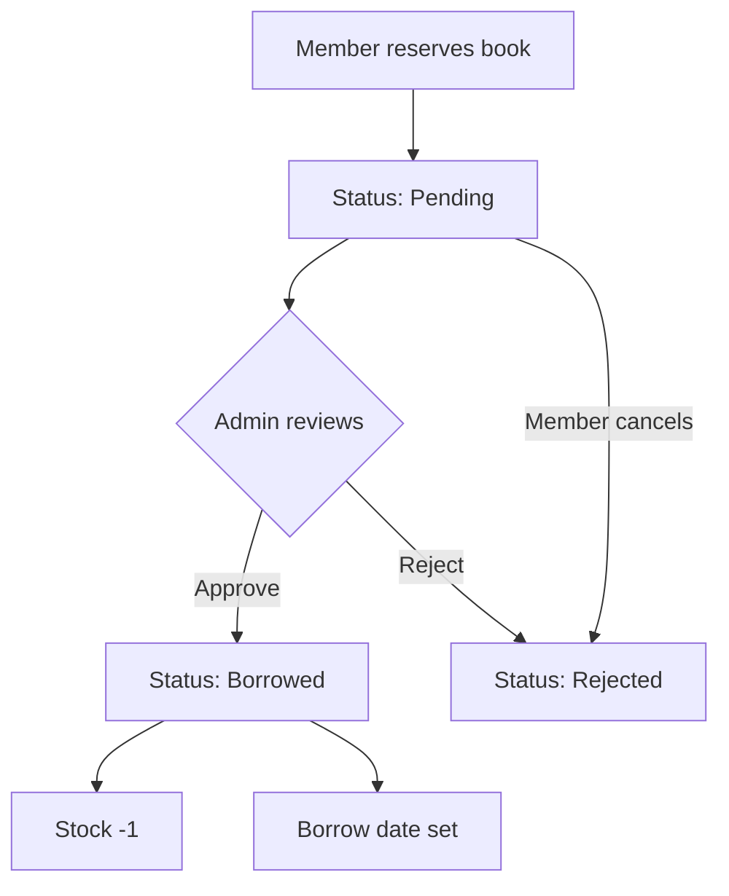

#### Borrowing Status Transitions

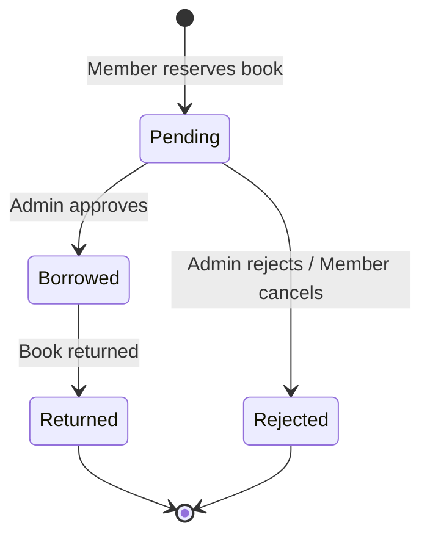

#### Borrowing Process Flow

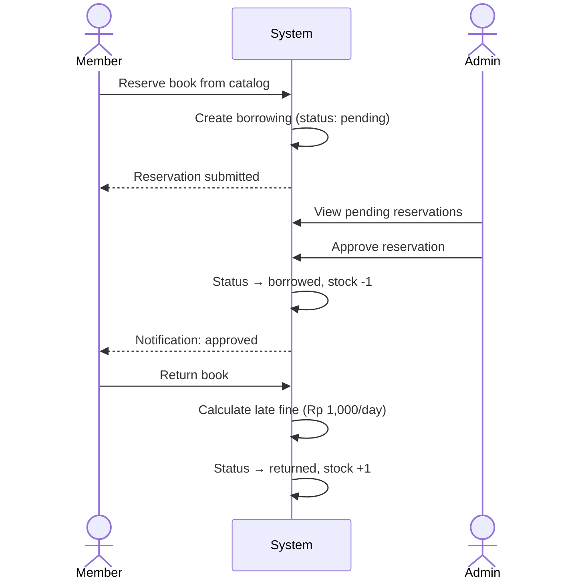

<p align="right">(<a href="#readme-top">back to top</a>)</p>

---

## Database Schema

### Entity Relationship

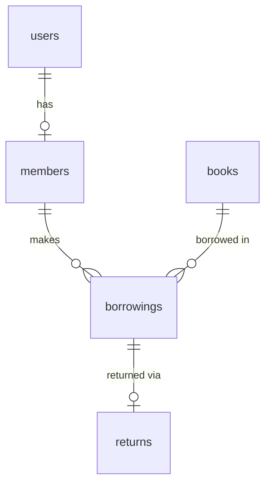

### Class Diagram (Eloquent Models)

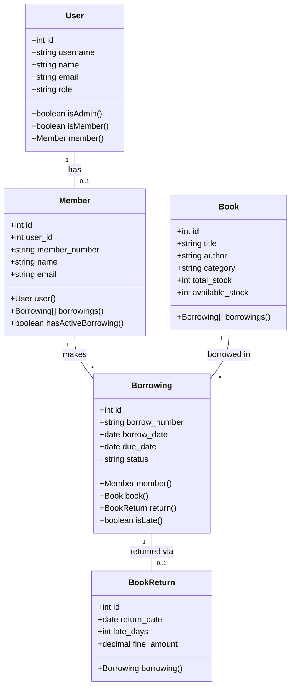

### Tables

#### users

| Column            | Type                   | Constraint         |
| ----------------- | ---------------------- | ------------------ |
| id                | bigint                 | PK, auto-increment |
| username          | varchar                | unique             |
| name              | varchar                | required           |
| email             | varchar                | required           |
| role              | enum('admin','member') | default: 'member'  |
| password          | varchar                | hashed (bcrypt)    |
| email_verified_at | timestamp              | nullable           |
| remember_token    | varchar                | nullable           |
| created_at        | timestamp              |                    |
| updated_at        | timestamp              |                    |

#### books

| Column          | Type         | Constraint                                       |
| --------------- | ------------ | ------------------------------------------------ |
| id              | bigint       | PK, auto-increment                               |
| title           | varchar      | required                                         |
| cover_image     | varchar      | nullable, stored in `storage/app/public/covers/` |
| author          | varchar      | required                                         |
| publisher       | varchar      | required                                         |
| isbn            | varchar      | unique, nullable                                 |
| category        | varchar      | required                                         |
| year            | year         | required, min: 1900                              |
| total_stock     | unsigned int | default: 0                                       |
| available_stock | unsigned int | default: 0                                       |
| location        | varchar      | nullable                                         |
| created_at      | timestamp    |                                                  |
| updated_at      | timestamp    |                                                  |

#### members

| Column        | Type      | Constraint                         |
| ------------- | --------- | ---------------------------------- |
| id            | bigint    | PK, auto-increment                 |
| user_id       | bigint    | FK → users, nullable, nullOnDelete |
| member_number | varchar   | unique, format: `AGT-YYYY-XXXX`    |
| name          | varchar   | required                           |
| email         | varchar   | unique                             |
| phone         | varchar   | nullable                           |
| address       | varchar   | nullable                           |
| join_date     | date      | required                           |
| created_at    | timestamp |                                    |
| updated_at    | timestamp |                                    |

#### borrowings

| Column        | Type      | Constraint                               |
| ------------- | --------- | ---------------------------------------- |
| id            | bigint    | PK, auto-increment                       |
| borrow_number | varchar   | unique, format: `PJ/YYYYMMDD/XXXX`       |
| member_id     | bigint    | FK → members, cascadeOnDelete            |
| book_id       | bigint    | FK → books, cascadeOnDelete              |
| borrow_date   | date      | required                                 |
| due_date      | date      | required, after borrow_date              |
| status        | string    | pending / borrowed / returned / rejected |
| created_at    | timestamp |                                          |
| updated_at    | timestamp |                                          |

#### returns

| Column       | Type          | Constraint                                   |
| ------------ | ------------- | -------------------------------------------- |
| id           | bigint        | PK, auto-increment                           |
| borrowing_id | bigint        | FK → borrowings, cascadeOnDelete             |
| return_date  | date          | required                                     |
| late_days    | unsigned int  | default: 0                                   |
| fine_amount  | decimal(10,2) | default: 0, calculated: late_days × Rp 1,000 |
| notes        | text          | nullable                                     |
| created_at   | timestamp     |                                              |
| updated_at   | timestamp     |                                              |

<p align="right">(<a href="#readme-top">back to top</a>)</p>

---

## Getting Started

### Prerequisites

- **PHP** >= 8.2
- **Composer** >= 2
- **Node.js** & **NPM**
- **DDEV** (recommended) — [Install DDEV](https://ddev.readthedocs.io/en/stable/users/install/)
- **MariaDB/MySQL** (if not using DDEV)

### Installation

#### Option 1: Using DDEV (Recommended)

```bash
# 1. Clone the repository
git clone https://github.com/username/sistem-manajemen-perpustakaan.git
cd sistem-manajemen-perpustakaan

# 2. Start DDEV (automatically configures PHP, MariaDB, Nginx)
ddev start

# 3. Install PHP dependencies
ddev composer install

# 4. Install Node.js dependencies
ddev npm install

# 5. Build frontend assets
ddev npm run build

# 6. Run database migrations and seed sample data
ddev artisan migrate --seed

# 7. Access the application
# → https://sistem-manajemen-perpustakaan.ddev.site
```

#### Option 2: Manual Setup (Without DDEV)

```bash
# 1. Clone the repository
git clone https://github.com/username/sistem-manajemen-perpustakaan.git
cd sistem-manajemen-perpustakaan

# 2. Install PHP dependencies
composer install

# 3. Create environment file
cp .env.example .env

# 4. Generate application key
php artisan key:generate

# 5. Configure database in .env file
#    DB_CONNECTION=mysql
#    DB_HOST=127.0.0.1
#    DB_PORT=3306
#    DB_DATABASE=perpustakaan
#    DB_USERNAME=root
#    DB_PASSWORD=

# 6. Run database migrations and seed sample data
php artisan migrate --seed

# 7. Create storage symlink (for cover images)
php artisan storage:link

# 8. Install Node.js dependencies
npm install

# 9. Build frontend assets
npm run build

# 10. Start development server
php artisan serve

# 11. Access the application
# → http://localhost:8000
```

<p align="right">(<a href="#readme-top">back to top</a>)</p>

---

## Usage

### Default Accounts

| Role       | Email                   | Password | Access                  |
| ---------- | ----------------------- | -------- | ----------------------- |
| **Admin**  | admin@perpustakaan.com  | password | Full system management  |
| **Member** | member@perpustakaan.com | password | Member portal & catalog |

### How to Use

#### As Admin

1. **Login** — Go to `/login` and sign in with `admin@perpustakaan.com` / `password`
2. **Add Books** — Navigate to Books menu → Create, fill in book details and stock
3. **Add Members** — Navigate to Members menu → Create, register new library members
4. **Process Borrowings** — Go to Borrowings → Create, select member and book
5. **Approve Reservations** — When members reserve books, approve them from Borrowings page
6. **Process Returns** — Open a borrowing record → Return, system auto-calculates late fines
7. **View Dashboard** — Monitor statistics, charts, and late borrowings

#### As Member

1. **Register** — Go to `/register` to create a new account
2. **Verify Email** — Check inbox for verification link, click to verify (or check Mailpit at `https://sistem-manajemen-perpustakaan.ddev.site:8026`)
3. **Browse Catalog** — Visit `/catalog` to search and filter books
4. **Reserve a Book** — Click on a book → Reserve, wait for admin approval
5. **View Borrowings** — Check your borrowing history at Member Portal → Pinjaman Saya
6. **Cancel Reservation** — If changed your mind, cancel pending reservations
7. **Edit Profile** — Update your phone and address from Profile page

### Routes Overview

#### Public Routes

| Method | URI               | Description                        |
| ------ | ----------------- | ---------------------------------- |
| GET    | `/`               | Redirect to catalog                |
| GET    | `/catalog`        | Book catalog with search & filters |
| GET    | `/catalog/{book}` | Book detail page                   |

#### Guest Routes (Not Logged In)

| Method | URI         | Description               |
| ------ | ----------- | ------------------------- |
| GET    | `/login`    | Login form                |
| POST   | `/login`    | Authenticate user         |
| GET    | `/register` | Registration form         |
| POST   | `/register` | Create new member account |

#### Authenticated Routes

| Method | URI       | Description                 |
| ------ | --------- | --------------------------- |
| POST   | `/logout` | Logout (invalidate session) |

#### Email Verification Routes (middleware: auth)

| Method | URI                                | Description               |
| ------ | ---------------------------------- | ------------------------- |
| GET    | `/verify-email`                    | Email verification prompt |
| GET    | `/verify-email/{id}/{hash}`        | Verify email from link    |
| POST   | `/email/verification-notification` | Resend verification email |

#### Member Routes (middleware: auth, member)

| Method | URI                                     | Description        |
| ------ | --------------------------------------- | ------------------ |
| GET    | `/member/dashboard`                     | Member dashboard   |
| GET    | `/member/borrowings`                    | Borrowing history  |
| GET    | `/member/profile`                       | View profile       |
| PUT    | `/member/profile`                       | Update profile     |
| POST   | `/catalog/{book}/reserve`               | Reserve a book     |
| POST   | `/member/borrowings/{borrowing}/cancel` | Cancel reservation |

#### Admin Routes (middleware: auth, admin)

| Method   | URI                               | Description                                             |
| -------- | --------------------------------- | ------------------------------------------------------- |
| GET      | `/dashboard`                      | Admin dashboard                                         |
| Resource | `/books`                          | Book CRUD (index, create, store, edit, update, destroy) |
| Resource | `/members`                        | Member CRUD                                             |
| Resource | `/borrowings`                     | Borrowing management                                    |
| POST     | `/borrowings/{borrowing}/approve` | Approve reservation                                     |
| POST     | `/borrowings/{borrowing}/reject`  | Reject reservation                                      |
| GET      | `/borrowings/{borrowing}/print`   | Print receipt                                           |
| GET      | `/borrowings/{borrowing}/return`  | Return form                                             |
| POST     | `/borrowings/{borrowing}/return`  | Process return                                          |

<p align="right">(<a href="#readme-top">back to top</a>)</p>

---

## Project Structure

```
sistem-manajemen-perpustakaan/
├── app/
│   ├── Http/
│   │   ├── Controllers/
│   │   │   ├── Auth/
│   │   │   │   ├── EmailVerificationPromptController.php  # Email verification prompt
│   │   │   │   ├── ResendVerificationEmailController.php  # Resend verification email
│   │   │   │   └── VerifyEmailController.php              # Process email verification
│   │   │   ├── AuthController.php          # Login, logout, role-based redirect
│   │   │   ├── BookController.php          # Book CRUD + cover image upload
│   │   │   ├── BookReturnController.php    # Return processing + fine calculation
│   │   │   ├── BorrowingController.php     # Borrowing CRUD + approve/reject
│   │   │   ├── CatalogController.php       # Public book catalog
│   │   │   ├── Controller.php              # Base controller
│   │   │   ├── DashboardController.php     # Admin dashboard with statistics
│   │   │   ├── MemberController.php        # Member CRUD
│   │   │   ├── MemberPortalController.php  # Member self-service portal
│   │   │   ├── RegisterController.php      # Member registration
│   │   │   └── ReservationController.php   # Book reservation & cancel
│   │   ├── Middleware/
│   │   │   ├── AdminMiddleware.php         # Restrict to admin role
│   │   │   ├── EnsureEmailIsVerified.php   # Check email verification status
│   │   │   └── MemberMiddleware.php        # Restrict to member role
│   │   └── Requests/
│   │       ├── RegisterRequest.php         # Registration validation
│   │       ├── ReserveRequest.php          # Reservation business rules
│   │       ├── StoreBookRequest.php        # Create book validation
│   │       ├── StoreBorrowingRequest.php   # Create borrowing validation
│   │       ├── StoreMemberRequest.php      # Create member validation
│   │       ├── StoreReturnRequest.php      # Create return validation
│   │       ├── UpdateBookRequest.php       # Update book validation
│   │       └── UpdateMemberRequest.php     # Update member validation
│   └── Models/
│       ├── Book.php                        # Book model + borrowings relation
│       ├── BookReturn.php                  # Return model (table: returns)
│       ├── Borrowing.php                   # Borrowing model + number generator
│       ├── Member.php                      # Member model + active borrowing check
│       └── User.php                        # User model + role helpers
├── bootstrap/
│   └── app.php                             # Middleware alias registration
├── config/
├── database/
│   ├── factories/
│   │   └── UserFactory.php
│   ├── migrations/                         # 10 migration files
│   ├── seeders/
│   │   ├── AdminSeeder.php                 # 1 admin account
│   │   ├── BookSeeder.php                  # 15 sample books (5 categories)
│   │   ├── BorrowingSeeder.php             # 12 sample transactions
│   │   ├── DatabaseSeeder.php              # Master seeder
│   │   └── MemberSeeder.php               # 24 members + 1 demo account
│   └── database.sqlite                     # SQLite (default, not used with DDEV)
├── public/
├── resources/
│   ├── css/
│   │   └── app.css                         # Tailwind directives (base)
│   ├── js/
│   │   ├── app.js
│   │   └── bootstrap.js
│   └── views/
│       ├── auth/                           # login, register
│       ├── books/                          # index, create, edit
│       ├── borrowings/                     # index, create, show, print
│       ├── catalog/                        # index, show (public)
│       ├── components/                     # reusable Blade components
│       ├── dashboard/                      # index (admin stats + charts)
│       ├── layouts/
│       │   ├── app.blade.php              # Admin layout (sidebar)
│       │   ├── member.blade.php           # Member layout (top navbar)
│       │   └── public.blade.php           # Public layout (top navbar)
│       ├── member/                         # dashboard, borrowings, profile
│       ├── members/                        # index, create, edit, show
│       ├── pagination/                     # custom pagination view
│       ├── returns/                        # create
│       ├── vendor/                         # vendor overrides
│       └── welcome.blade.php
├── routes/
│   ├── console.php
│   └── web.php                             # All web routes
├── .ddev/                                  # DDEV configuration
│   └── config.yaml                         # PHP 8.4, MariaDB 11.8, Nginx
├── .github/
│   ├── PRD - Sistem Perpustakaan Digital.md
│   └── ganjil - Aplikasi Manajemen Perpustakaan.md
├── composer.json
├── package.json
├── vite.config.js
├── tailwind.config.js
├── phpunit.xml
└── README.md
```

<p align="right">(<a href="#readme-top">back to top</a>)</p>

---

## Application Architecture

### MVC Pattern

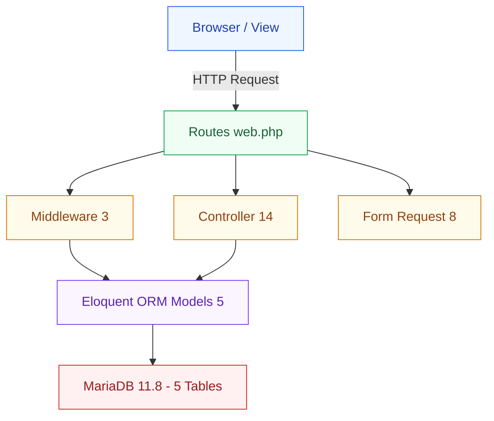

### Business Logic

| Logic            | Implementation                                                                     |
| ---------------- | ---------------------------------------------------------------------------------- |
| Borrow Number    | `PJ/YYYYMMDD/XXXX` — auto-increment daily (`Borrowing::generateBorrowNumber()`)    |
| Member Number    | `AGT-YYYY-XXXX` — auto from user ID (`RegisterController::generateMemberNumber()`) |
| Late Fine        | Rp 1,000 per day — calculated in `BookReturnController::create()`                  |
| Borrow Duration  | 7 days from approval date                                                          |
| Stock Management | Decremented on approve / incremented on return                                     |

### Role-Based Access

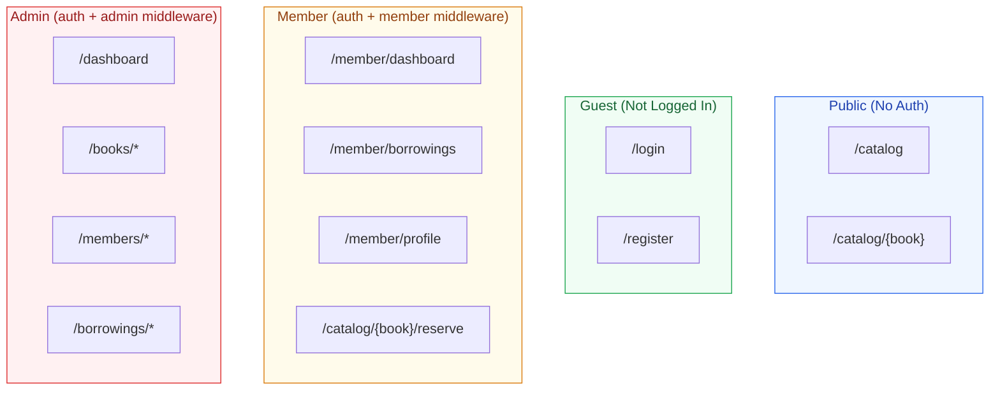

<p align="right">(<a href="#readme-top">back to top</a>)</p>

---

## Roadmap

- [ ] Soft delete for books and members
- [ ] Activity logging / audit trail
- [ ] REST API for external integration
- [ ] Automated fine calculation via scheduled command
- [ ] Email notifications for due dates and reservations
- [ ] Export data to PDF/Excel
- [ ] Multi-language support
- [ ] Deploy to cloud platform

<p align="right">(<a href="#readme-top">back to top</a>)</p>

---

## Milestone Status

| Milestone         | Status         | Evidence                                                                |
| ----------------- | -------------- | ----------------------------------------------------------------------- |
| M1: Inisialisasi  | ✅ Completed   | 10 migrations, Login/Register with session regeneration, bcrypt hashing |
| M2: Core Features | ✅ Completed   | CRUD Book & Member, 8 Form Request classes with validation              |
| M3: Integrasi     | ✅ Completed   | AdminMiddleware + MemberMiddleware, FK relations, Reservation system    |
| M4: Finalisasi    | 🔄 In Progress | UI Bootstrap 5 ✅, Deployment pending, README completed                 |

<p align="right">(<a href="#readme-top">back to top</a>)</p>

---

## Screenshots

### Admin Dashboard

<!-- Screenshot: Halaman /dashboard — statistik, grafik, tabel terlambat -->

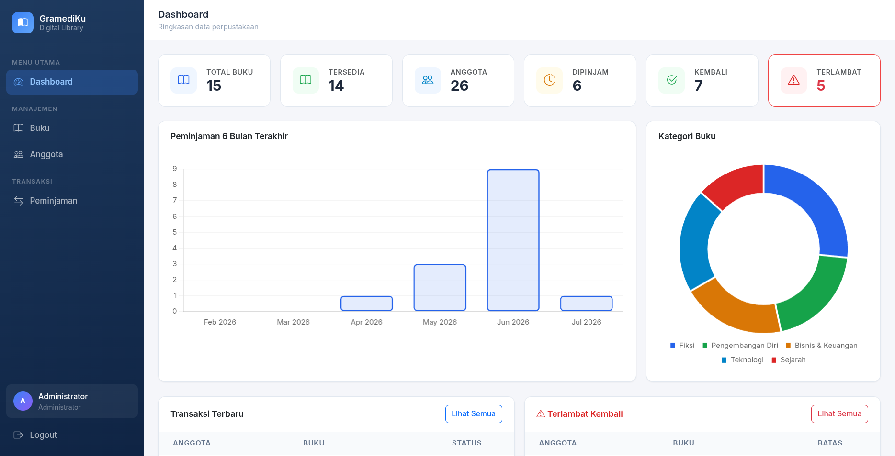

### Book Catalog

<!-- Screenshot: Halaman /catalog — kartu buku, search bar, filter -->

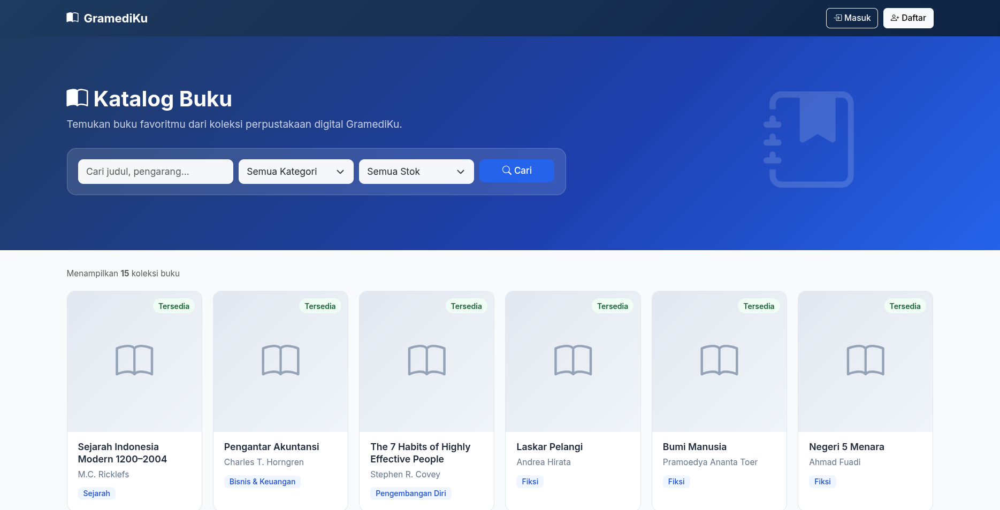

### Member Portal

<!-- Screenshot: Halaman /member/dashboard — statistik member, pinjaman aktif -->

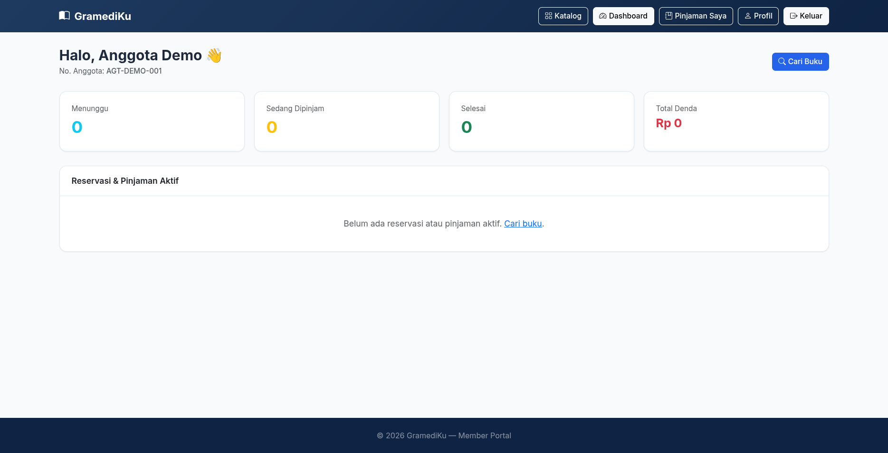

### Borrowing Management

<!-- Screenshot: Halaman /borrowings — tabel peminjaman, tombol approve/reject -->

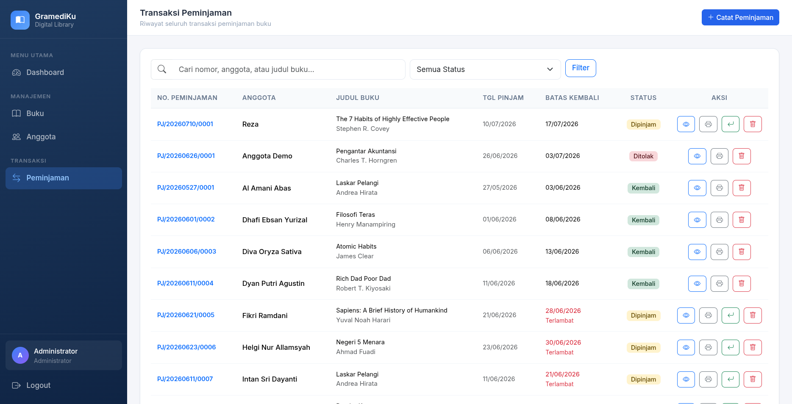

### Book Detail

<!-- Screenshot: Halaman /catalog/{book} — detail buku, tombol reservasi -->

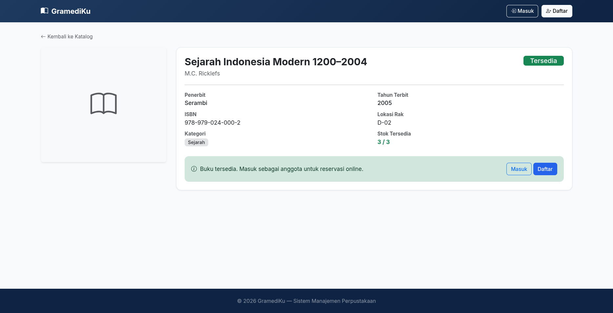

### Login Page

<!-- Screenshot: Halaman /login — form login -->

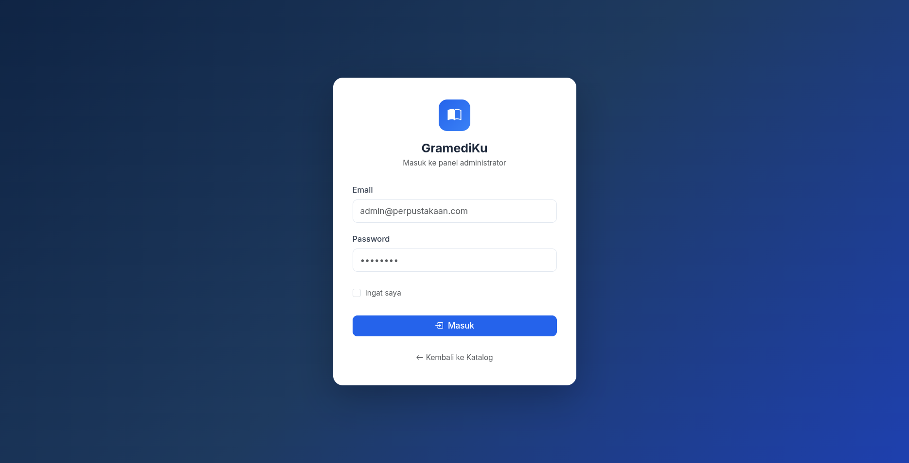

### Register Page

<!-- Screenshot: Halaman /register — form register -->

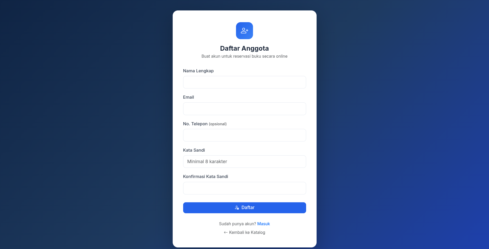

<p align="right">(<a href="#readme-top">back to top</a>)</p>

---

## Contributing

This project is developed as part of the Web Programming 3 (Laravel) course final assignment.

### Branching Strategy

| Branch | Purpose |
|--------|---------|
| `feature/migration-and-models` | Database migrations & Eloquent models |
| `feature/authentication` | Login, logout, admin middleware |
| `feature/books` | Book CRUD |
| `feature/members` | Member CRUD |
| `feature/borrowings` | Borrowing & return transactions |
| `feature/dashboard` | Admin dashboard with statistics |
| `feature/ui-improvements` | UI/UX improvements |
| `feature/uas-m1-member-auth-schema` | M1: Inisialisasi — schema & auth |
| `feature/uas-m2-member-portal` | M2: Core Features — member portal |
| `feature/uas-m3-middleware-relasi` | M3: Integrasi — middleware & relations |
| `feature/uas-m4-deployment-dokumentasi` | M4: Finalisasi — deployment & docs |

<p align="right">(<a href="#readme-top">back to top</a>)</p>

---

## Authors

**Reza Asriano Maulana** — Full Stack Engineer

<p align="right">(<a href="#readme-top">back to top</a>)</p>

---

## License

Distributed under the MIT License. See `LICENSE` for more information.

<p align="right">(<a href="#readme-top">back to top</a>)</p>
